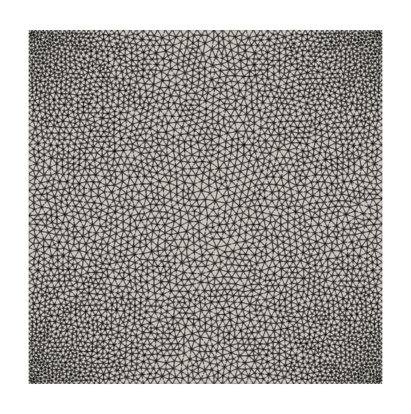
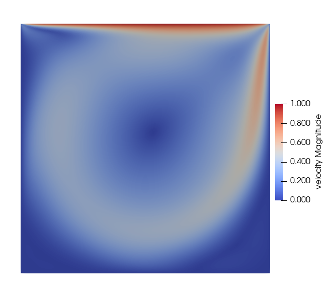
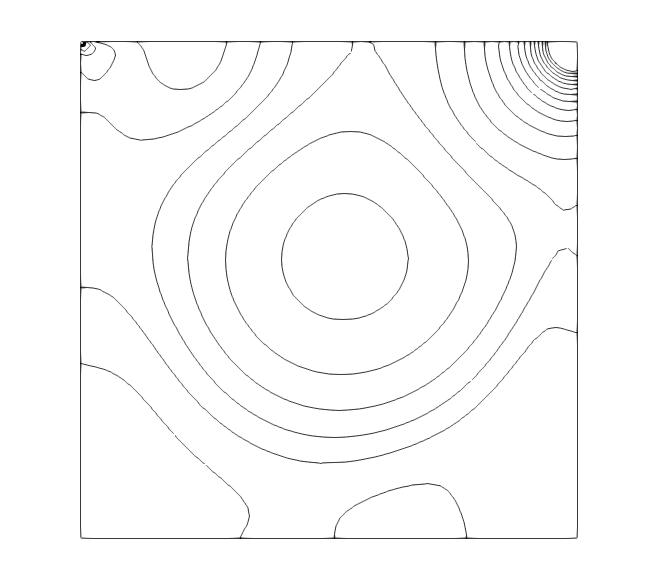

Example 1 - Lid-driven cavity in 2D
====================================

In this example, we simulate the benchmark example of lid-driven cavity for a Reynolds number of 1000.


Mesh used for the simulation. P2/P1 element is used. Download [LDC-P2-mesh3.msh](LDC-P2-mesh3.msh).



The configuration file is shown below.
```
Files
{
  mesh : LDC-P2-mesh3
}
    
Fluid Properties
{
  rho  : 1.0
  mu   : 0.001
}
    
Body Force
{
    value          :  0  0  0
    TimeFunction   :  1
}
    
Element Properties
{

    type :  P2P1
!    type :  P2bP1dc

}
    
Boundary Conditions
{
    lid
    {
        type         : specified
        dof          : VX
        value        : 1-exp(100*(x-1))-exp(-100*x)
        timefunction : 1
    }
    
    lid
    {
        type          : specified
        dof           : VY
        value         : 0.0
        timefunction  : 1
    }
    
    wall
    {
        type          : wall
    }
}

Time Functions
{
    
! lam(t) = p1 + p2*t + p3*sin(p4*t+p5) + p6*cos(p7*t+p8)
!
! id   t0    t1    p1   p2     p3    p4    p5    p6    p7    p8
    
!   1   0.0   1000.0  1.0  0.0    0.0   0.0   0.0   0.0   0.0   0.0
    
   1   0.0      1.0  0.0  1.0    0.0   0.0   0.0   0.0   0.0   0.0
   1   1.0   1000.0  1.0  0.0    0.0   0.0   0.0   0.0   0.0   0.0
    
}
    
Solver
{
    schemetype    :  0
    
    !timescheme        :  BDF1
    timescheme         :  STEADY
    !timescheme         : Galpha
    
    spectralRadius     :  0.0
    
    finalTime          :  2.0
    
    timeStep           :  0.05
    
    maximumSteps       :  20000
    
    maximumIterations  :  10
    
    tolerance          :  1.0e-7
    
    outputFrequency    :  1
    
}
    
Initial Conditions
{
    Xvelocity       :  0.0
    Yvelocity       :  0.0
}

```


The contour plot of velocity magnitude and pressure are shown below.

Contour plot of velocity magnitude.



Contour plot of pressure.


