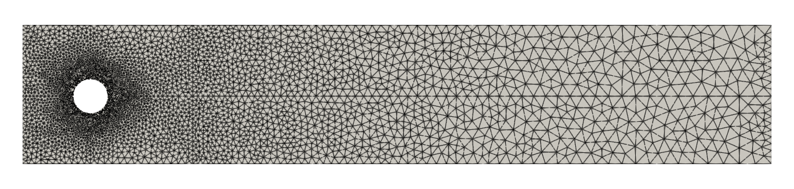
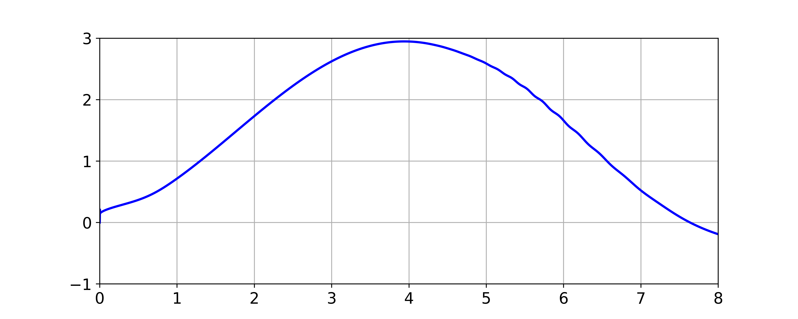
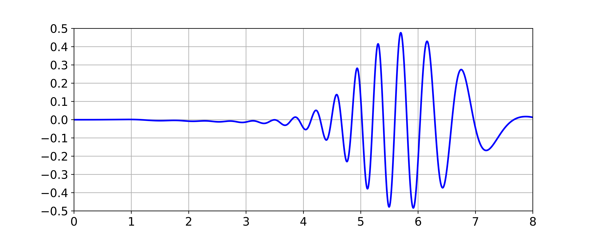
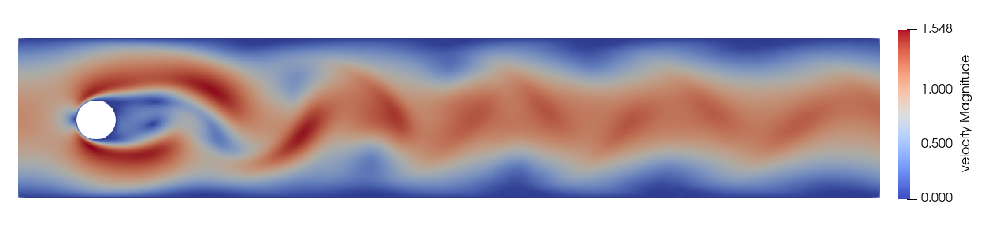
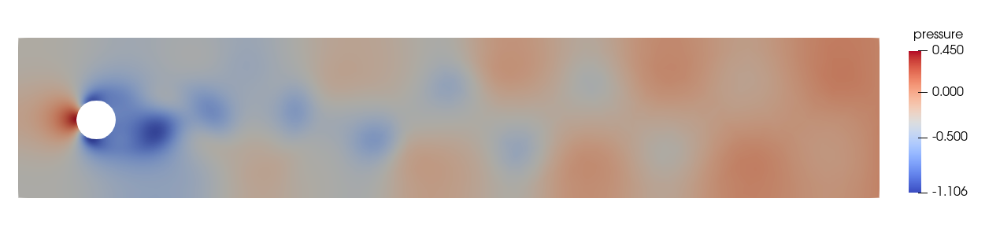

Example 3 - Unsteady flow past a cylinder in 2D - Turek benchmark
=================================================================

In this example, we simulate unsteady flow past a circular cylinder for a Reynolds number of 100. This is the `Test case 2D-3` of the paper [Benchmark Computations of Laminar Flow Around a Cylinder](https://wwwold.mathematik.tu-dortmund.de/lsiii/cms/papers/SchaeferTurek1996.pdf) by Schafer and Turek.

Mesh used for the simulation. P2/P1 element is used. The same mesh file used for the steady-state case.



The configuration file is shown below.
```
Files
{
  mesh : Turekcylinder2d-P2
}
    
Fluid Properties
{
  rho  : 1.0
  mu   : 0.001
}

Body Force
{
    value         :  0  0  0
    TimeFunction  :  1
}

Element Properties
{
    type : P2P1
}

Boundary Conditions
{
    inlet
    {
        type          :  specified
        dof           :  Xvelocity
        ! Re=100
        value         :  6*y*(0.41-y)/0.1681
        ! Re=20
        !value         :  1.2*y*(0.41-y)/0.1681
        timefunction  :  1
    }

    inlet
    {
        type          :  specified
        dof           :  Yvelocity
        value         :  0.0
        timefunction  :  1
    }
    
    bottomedge
    {
        type     :  wall
    }
    
    topedge
    {
        type     :  wall
    }
    
    cylinder
    {
        type     :  wall
    }
}

Time Functions
{
    ! lam(t) = p1 + p2*t + p3*sin(p4*t+p5) + p6*cos(p7*t+p8)
    !
    ! id    t0       t1    p1   p2     p3    p4    p5    p6    p7    p8
    
    !   1    0.0      1.0  0.0  1.0    0.0   0.0   0.0   0.0   0.0   0.0
    !   1    1.0   1000.0  1.0  0.0    0.0   0.0   0.0   0.0   0.0   0.0
    
       1    0.0     1000.0  0.0  0.0    1.0   0.39270   0.0   0.0   0.0   0.0

}

Solver
{
    schemetype    :  0
    
    !timescheme         :  STEADY
    timescheme        :   Galpha

    spectralRadius     :  0.0

    finalTime          :  8.0

    timeStep           :  0.002

    maximumSteps       :  10000

    maximumIterations  :  10

    tolerance          :  1.0e-5

    outputFrequency    :  1
    
}

Initial Conditions
{
    Xvelocity         :  0.0
    Yvelocity         :  0.0
}

Patch Output
{
    cylinder
}

```

The forces on the patch `cylinder` are writtent to a file `forces-<patch-name>.dat` file. The plots of drag and lift coefficient are shown below.

Plot of drag coefficient.



Plot of lift coefficient.



The contour plot of velocity magnitude and pressure at t=6 are shown below.

Contour plot of velocity magnitude.


Contour plot of pressure.



