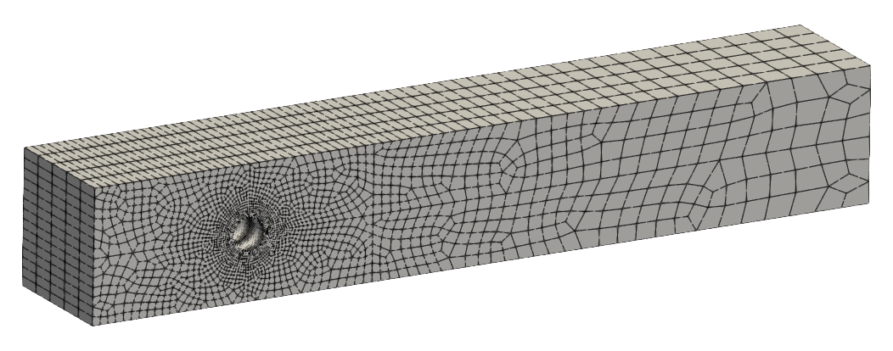
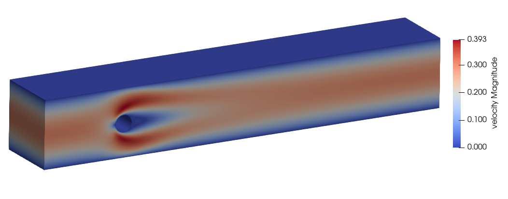
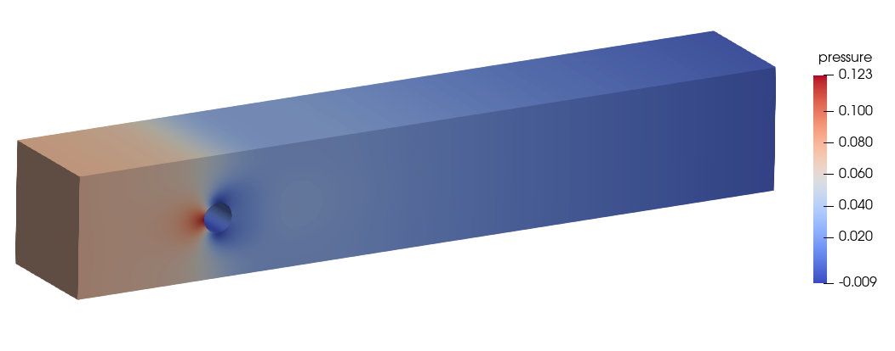

Example 4 - Steady flow past a cylinder in 3D 
==============================================

In this example, we simulate steady flow past a circular cylinder in 3D for a Reynolds number of 20. This is an extended version of the 2D problem.

Mesh used for the simulation. Q2/Q1 element is used. Donwload [Turekcylinder3d-Q2-coarsemesh.msh](Turekcylinder3d-Q2-coarsemesh.msh).



The configuration file is shown below.
```
Files
{
    mesh : Turekcylinder3d-Q2-coarsemesh
}
    
Fluid Properties
{
    rho  : 1.0
    mu   : 0.001
}

Body Force
{
    value         :  0  0  0
    TimeFunction  :  1
}

Element Properties
{
    type : Q2Q1
}

Boundary Conditions
{
    inlet
    {
        type          :  specified
        dof           :  Xvelocity
        ! Re=100
        !value         :  6*y*(0.41-y)/0.1681
        ! Re=20
        value         :  1.2*y*(0.41-y)/0.1681
        timefunction  :  1
    }
    
    inlet
    {
        type          :  specified
        dof           :  Yvelocity
        value         :  0.0
        timefunction  :  1
    }
    
    inlet
    {
        type          :  specified
        dof           :  Zvelocity
        value         :  0.0
        timefunction  :  1
    }

    bottomedge
    {
        type     :  wall
    }
    
    topedge
    {
        type     :  wall
    }
    
    cylinder
    {
        type     :  wall
    }

    front
    {
        type          :  specified
        dof           :  Zvelocity
        value         :  0.0
    }
    
    back
    {
        type          :  specified
        dof           :  Zvelocity
        value         :  0.0
    }

}


Time Functions
{
    ! lam(t) = p1 + p2*t + p3*sin(p4*t+p5) + p6*cos(p7*t+p8)
    !
    ! id    t0       t1    p1   p2     p3    p4    p5    p6    p7    p8
    
       1    0.0      1.0  0.0  1.0    0.0   0.0   0.0   0.0   0.0   0.0
       1    1.0   1000.0  1.0  0.0    0.0   0.0   0.0   0.0   0.0   0.0
    
    !   2   0.0   1000.0  2.0  1.0    0.0   0.0   0.0   0.0   0.0   0.0
    
}

Solver
{
    schemetype    :  0
    
    timescheme         :  STEADY
    !timescheme        :   Galpha
    
    spectralRadius     :  0.0
    
    finalTime          :  2.0
    
    timeStep           :  0.2
    
    maximumSteps       :  10000
    
    maximumIterations  :  10
    
    tolerance          :  1.0e-5
      
    outputFrequency    :  1
    
}


Initial Conditions
{
    Xvelocity         :  0.0
    Yvelocity         :  0.0
    Zvelocity         :  0.0
}
    
Patch Output
{
    cylinder
}

```


The contour plot of velocity magnitude and pressure are shown below.

Contour plot of velocity magnitude.



Contour plot of pressure.



