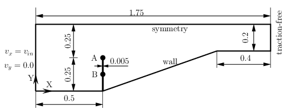
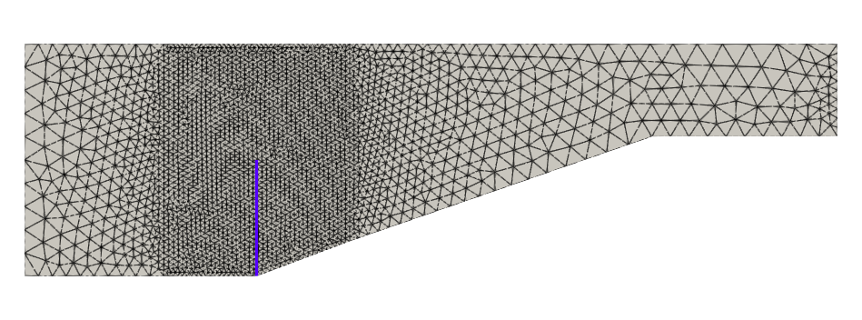
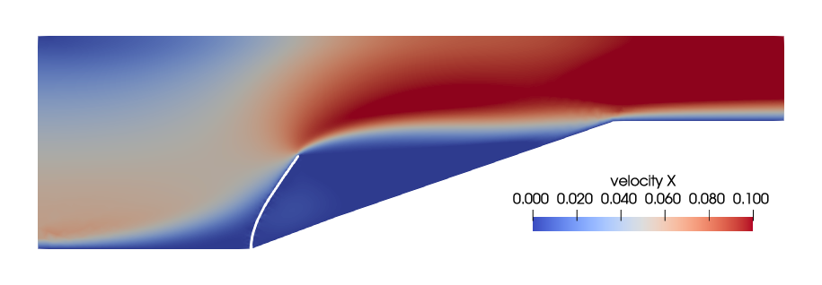
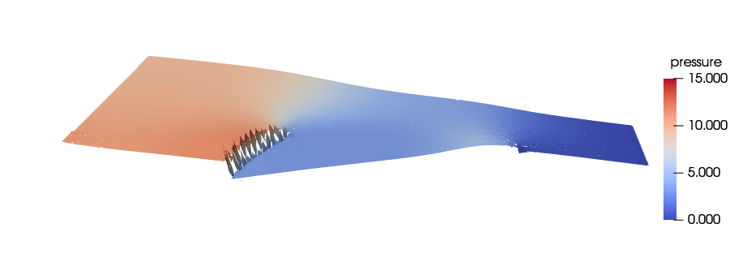

Example 1 - A wall-mounted beam in a convergent channel
=========================================================

In this example, we simulate coupled FSI of a wall-mounted cantilever beam in a converging channel.

This is a [benchmark example](https://www.sciencedirect.com/science/article/abs/pii/S0045794908002605) used for demonstrating the accuracy of FSI simulation frameworks and the stability of FSI coupling schemes.

The setup of the problem is shown below
{width=700}


Mesh used for the simulation. P2b/P1dc element is used. Download [fluidmesh.msh](./inputs/fluid/fluidmesh.msh).



The content of `config_fsi` file is shown below.
```
  predictorType      :  1
  
  forceRelaxation    :  0.05

  finalTime          :  100.0

  timeStep           :  0.2

  maximumSteps       :  1000

  minimumIterations  :  1

  maximumIterations  :  10

  tolerance          :  1.0e-7
  
  outputFrequency    :  1

```


The configuration file for the `fluid` problem is shown below.
```
Fluid Properties
{
  density     :  1750.0
  viscosity   :  0.1
}


Body Force
{
    value         :  0  0  0
    timefunction  :  1
}


Element Properties
{
    type  :  p2bp1dc
}


Boundary Conditions
{
    inlet
    {
        type          : specified
        dof           : Xvelocity
        value         : 0.06067*(1.0-y*y/0.25)
        timefunction  : 1
    }

    inlet
    {
        type          : specified
        dof           : Yvelocity
        value         : 0.0
        timefunction  : 1
    }


    symmetry
    {
        type          : specified
        dof           : Yvelocity
        value         : 0.0
    }

    bottomedge
    {
        type          : wall
    }

}


Time Functions
{

! lam(t) = p1 + p2*t + p3*sin(p4*t+p5) + p6*cos(p7*t+p8)
!
! id   t0    t1      p1   p2     p3    p4    p5    p6    p7    p8

  1   0.0     10.0    0.5   0.0   0.0   0.0   0.0   -0.5   0.3141592   0.0
  1  10.0   1000.0    1.0   0.0   0.0   0.0   0.0    0.0   0.0   0.0

}


Solver
{
  schemetype          :  0


  timescheme         :  BDF1
  !timescheme         :  Galpha
  !timescheme         :  STEADY

  spectralRadius     :  0.0

  finalTime          :  1.0

  timeStep         :   0.1  0.1  0.1

  maximumSteps       :  10

  maximumIterations  :  10

  tolerance          :  1.0e-7

  debug              :  0
  
  outputFrequency    :  1
}


Initial Conditions
{
        Xvelocity       :  0.0
        Yvelocity       :  0.0
}

```


The configuration file for the `solid` problem is shown below.
```
Domains
{

  beam
  {
    Material   : 1
    Element    : 1
  }

}


Material
{
  id               : 1
  name             : Matl_LinearElastic
  density          : 1500.0
  data             : 2.3e6  0.45
}


Element
{
  id            : 1
!  type          : SolidElement3D
!  type          : BeamElement2DEulerBernoulli
  type          : ELEM_BEAM_2D_NODES2

  data          :  0.005 1.0417e-8   0.8333  0.0  0.0  0.0
}


Body Force
{
    value        :  0  0  0
    TimeFunction :  1
}


Boundary Conditions
{
    end1
    {
        type         :  fixed
    }

}


Solver
{

!formulation     :    IMPLICIT

!solvertype       :   arclength
solvertype       :   newton

!timescheme      :    BDF1
timescheme      :    CHalpha
!timescheme       :   STEADY

spectralRadius   :   0.0

finalTime        :   1.0

timeStep         :   0.1  0.1  0.1

maximumSteps      :  100

maximumIterations  :  10

tolerance          : 1.0e-7

debug              : 0

}

```


The contour plot of velocity magnitude and pressure are shown below.

Contour plot of velocity magnitude.



Contour plot of pressure.


