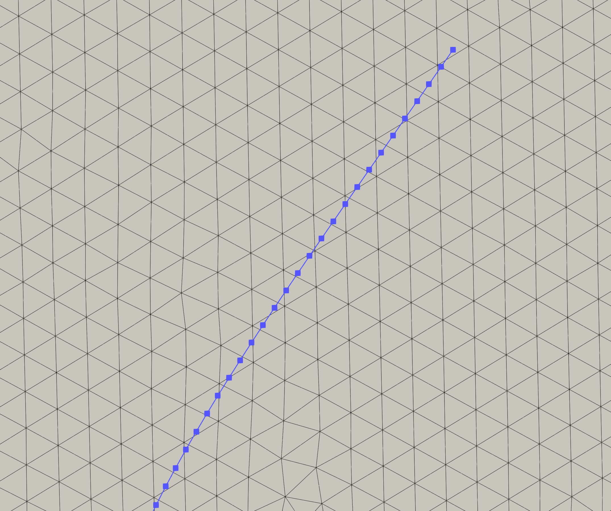

Inputs for FSI problems
========================

FSI problems consists of both the fluid and solid domains. Therefore, for the FSI problems, we need to specify

* The fluid mesh (and the relevant BCs, time scheme parameters, solver parameters)
* The solid mesh (and the relevant BCs, time scheme parameters, solver parameters)
* The interface mesh

The solid is modelled using beam elements in 2D and shell elements in 3D. Therefore, the immersed interface is made of line elements in 2D and surface elements in 3D. The nodes of the solid should be such that there is at least one node per fluid element, as shown below.
{width=400}


## File structure

A directory named `inputs` is the root directory in which the input files are provided. The file structure is organised as follows:
```
└── inputs
    ├── fluid
    │   ├── config
    │   ├── fluidmesh.msh
    │   ├── immersedsolid.dat
    │   └── petsc_options.dat
    ├── solid
    │   ├── config
    │   ├── petsc_options.dat
    │   └── solidmesh.msh
    ├── config_fsi
    ├── petsc_options.dat
```

The details of contents of the `inputs` folder are provided below.

* `fluid` subfolder
    This folder contains all the input needed for the fluid problem, including the details of the interface.
    - `fluidmesh.msh` is the mesh file for the fluid domain.
    - `config` is the configuration file we use for the CFD problem.
    - `immersedsolid.dat` is the mesh file for the interface.
        * This file needs three fields: 1. Dimension, 2. Node coordinates and 3. Element-node connecvitity.
        * This file can be prepared once the mesh for the solid domain is created.
        * A sample file is shown below.

        ```
        Dimension
        2
        
        Nodes
        41
        1	0.5000	0.0000
        2	0.5000	0.2500
        3	0.5000	0.0063
        4	0.5000	0.0125
        5	0.5000	0.0188
        .
        .
        .

        Immersed Boundary Elements
        40
        1	1	1	3
        2	1	3	4
        3	1	4	5
        4	1	5	6
        5	1	6	7
        .
        .
        .
        ```

        **NOTE**: The second entry in the `Immersed Boundary Elements` block is the dummy index.

    - `petsc_options.dat` is the PETSc options file for the fluid solver.

* `solid` subfolder
    This folder contains all the input needed for the solid problem.
    - `solidmesh.msh` is the mesh file for the solid domain.
    - `config` is the configuration file for the solid domain.
    - `petsc_options.dat` is the PETSc options file for the solid solver.
* `config_fsi` file
    - Specifies the details of the FSI coupling scheme.
    - The time step specified here takes precedance over that specified in the invididual `config` files for the fluid and solid.
    - Important parameters to be specified in this file are
        * `predictorType`: The type of predictor to be used. Options are: 1 (first-order predictor) and 2 (second-order predictor).
        The predictors are force based.
        * `forceRelaxation`: Relaxation factor for the partitioned scheme. Should be between 0.0 and 1.0. Typically, lower values (<0.1) are used for flexible structures.
        * `timeStep`: Time step size. This will overwrite time steps specified in the config files for the fluid and solid problems.
        * `finalTime`: Time until which the simulation needs to be run.
        * `maximumSteps`: Maximum number of time steps to run.
        * `outputFrequency`: The frequency at which to write the output VTK files. Writes every Nth time step.
    - The content of a sample `config_fsi` file is shown below.
      ```
        predictorType      :  1
        
        forceRelaxation    :  0.05
      
        timeStep           :  0.2
      
        finalTime          :  100.0

        maximumSteps       :  1000

        outputFrequency    :  1
      ```


* `petsc_options.dat` file
    - PETSc options file for the solver. At the moment, this is the only file used for PETSc options. Meaning that the files in `fluid` and `solid` subfolders are ignored.


